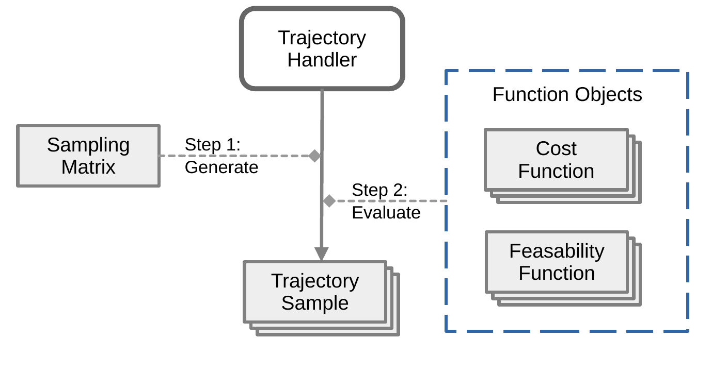

# Frenetix: C++-accelerated Trajectory Planning in a Frenét Frame
[](https://zenodo.org/record/8392335)

A Python library to sample polynomial trajectories in a curvilinear
coordinate system and evaluate them for feasibility and cost.

## Installation

Binary wheels are automatically built for releases. As a result,
you can install a Frenetix release by simply running `pip install frenetix`.

Frenetix is designed to be built locally with minimal user intervention.
Apart from a Python environment of your choice,
you only need a C++ compiler as well as a Fortran compiler.
`gfortran` is commonly available on Linux distributions.

To build Frenetix locally, `pip install .` should be sufficient.

## Usage
The fundamental operating principle of Frenetix is based on the following paper:
> M. Werling, J. Ziegler, S. Kammel and S. Thrun, "Optimal trajectory generation for dynamic street scenarios in a Frenét Frame," 2010 IEEE International Conference on Robotics and Automation, Anchorage, AK, USA, 2010, pp. 987-993, doi: 10.1109/ROBOT.2010.5509799.

In short, planning using Frenetix consists of these steps:
1. Specifying which trajectories should
be sampled using a sampling matrix, consisting of longitudinal, lateral and temporal initial and final values
2. Generating the trajectories
3. Converting the trajectories from curvilinear to cartesian space
4. Evaluating feasability functions
5. Evaluating cost functions
6. Retrieving the trajectories, possibly sorted by feasability and cost



### Quick Start
First create a trajectory handler object, specifying the desired time step `dt`:
```python
import frenetix
handler = frenetix.TrajectoryHandler(dt=self.config_plan.planning.dt)
```

Then create a special curvilinear coordinate system object -
this uses the same curvilinear coordinate system as the
CommonRoad Drivability Checker under the hood, but
we currently require this wrapper to provide some additional functions.
`reference_path` should be a sequence of points describing the reference path. Please make sure that the points are neither too far apart nor too close together, experience suggests that keeping the points about 1 meter apart is a good idea.
```
coordinate_system_cpp = frenetix.CoordinateSystemWrapper(reference_path)
```

You always need to add the `FillCoordinates` function
which converts the polynomial trajectories (in curvilinear coordinates) to usable cartesian coordinates.
```python
handler.add_function(
    frenetix.trajectory_functions.FillCoordinates(
        lowVelocityMode,
        initialOrientation,
        coordinateSystem=coordinate_system_cpp,
        horizon=horizon
    )
)
```
- `lowVelocityMode` enables low velocity mode as
described in the paper mentioned above.
- `initialOrientation` is the initial global orientation of the ego vehicle
- `horizon` is the sampling horizon

#### Feasability Functions
You can then add feasability functions like this:
```python
import frenetix.trajectory_functions.feasability_functions as ff

handler.add_feasability_function(
    ff.CheckYawRateConstraint(
        deltaMax,
        wheelbase,
        wholeTrajectory
    )
)
```

The following feasability functions are available:

- `CheckYawRateConstraint(deltaMax, wheelbase, wholeTrajectory)`:
  Checks whether yaw rate is feasible under the Kinematic Bicycle model, based on maximum steering angle `deltaMax` and `wheelbase`.
  `wholeTrajectory` is a bool that specifies
  whether the feasability check should include
  the enlarged parts of the trajectory
  if trajectory enlargement is enabled.

- `CheckAccelerationConstraint(switchingVelocity, maxAcceleration, wholeTrajectory)`:
   Checks whether acceleration is feasible.

- `CheckCurvatureConstraint(deltaMax, wheelbase, wholeTrajectory)`

- `CheckCurvatureRateConstraint(wheelbase, velocityDeltaMax, wholeTrajectory)`

#### Cost Functions
You can add most cost functions like this:
```python
import frenetix.trajectory_functions.cost_functions as cf

handler.add_cost_function(
    cf.CalculateAccelerationCost(name, cost_weight)
)
```
The name can later be used to retrieve the cost value from a sampled trajectory.

The following cost functions follow the signature above:
- `CalculateAccelerationCost`
- `CalculateJerkCost`
- `CalculateLateralJerkCost`
- `CalculateLongitudinalJerkCost`
- `CalculateOrientationOffsetCost`
- `CalculateLaneCenterOffsetCost`
- `CalculateDistanceToReferencePathCost`

The prediction cost function needs additional steps:
```python
handler.add_cost_function(
    cf.CalculateCollisionProbabilityFast(
        name,
        weight,
        predictions,
        vehicle_length,
        vehicle_width,
        wb_rear_axle
    )
)
```
- `vehicle_length`/`vehicle_width` specify ego vehicle dimensions
- `wb_rear_axle` should be the distance from the center reference point of the vehicle to the rear axle
- `predictions` expects a list of `frenetix.PredictedObject`s.
  They can be built using `PredictedObject(id, predicted_path, length, width)`.
  `predicted_path` should be a list of `frenetix.PoseWithCovariance` objects,
  which are derived from the ROS geometry message of the same name.
  They can be built using `PoseWithCovariance(position, orientation, covariance_matrix)`,
  where `position` is a three-dimensional position,
  `orientation` is a quaternion and `covariance_matrix` is a 6x6 matrix.
  

`CalculateDistanceToObstacleCost(name, weight, obstacle_positions)` expects a list of obstacle
positions.

#### Generating Trajectories
Finally, you can generate and evaluate trajectories like this:
```python
# Reset state
handler.reset_Trajectories()

# Generate trajectories
handler.generate_trajectories(sampling_matrix, low_velocity_mode)

# Run concurrent feasability and cost function evaluation
handler.evaluate_all_current_functions_concurrent(True)
```

The trajectories can then be retrieved:
```
for trajectory in self.handler.get_sorted_trajectories():
    # Some examples of what you could do:

    # Skip iterating over infeasible trajectories
    if not trajectory.feasible:
        break

    print(trajectory.cost)

    # Print longitudinal coordinates
    print(trajectory.curvilinear.s)

    # Print cost and feasability values
    print(trajectory.costMap)
    print(trajectory.feasabilityMap)
```